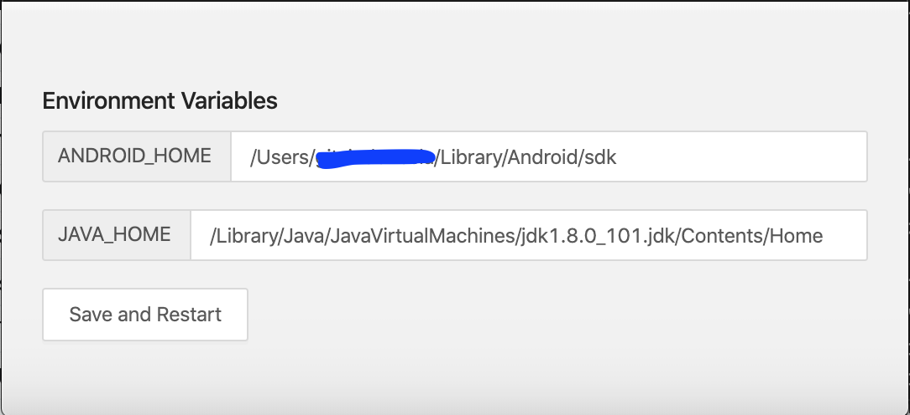
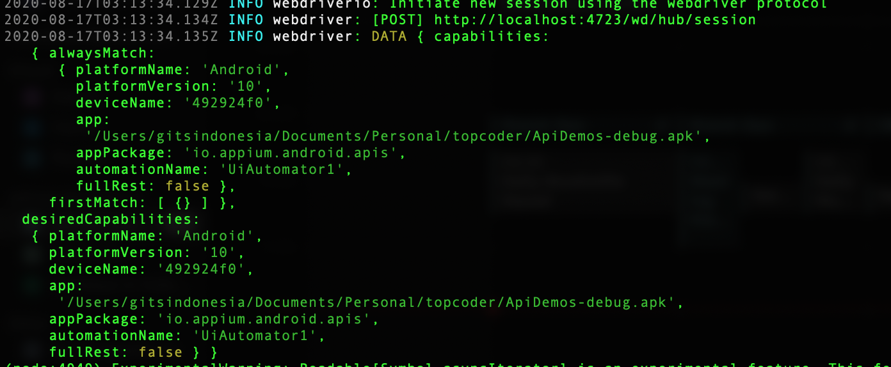

# Appium - Learning Series -Week 1/3 Write your first test scripts for Android

**user topcoder : yatnosudar**

This guide for running project &quot;Appium - Learning Series -Week 1/3 Write your first test scripts for Android&quot; from Topcoder Appium Learning Series!.

### Objective;

Create Android test scripts with Appium for the tools.

1. The test script can rotate Android to Landscape.
2. The test script can screenshot the landscape screen.
3. The result screenshot saves to the directory of the project.

### Requirement;

1. Visual Studio Code as IDE
2. NodeJS for [Desired Capabilities](http://appium.io/docs/en/writing-running-appium/caps/)
3. [Appium 1.18.0-1](https://github.com/appium/appium-desktop/releases/tag/v1.18.0-1)
  a . client library with node js : [http://appium.io/docs/en/about-appium/appium-clients/index.html](http://appium.io/docs/en/about-appium/appium-clients/index.html)
  b. installation step :
[https://www.techaheadcorp.com/blog/how-to-install-appium-on-mac/](https://www.techaheadcorp.com/blog/how-to-install-appium-on-mac/)
4. Apk test [**ApiDemos-debug.apk**](https://github.com/appium/appium/blob/master/sample-code/apps/ApiDemos-debug.apk)
5. Android SDK 8 or higher
  a. installation step : [https://developer.android.com/studio](https://developer.android.com/studio)
6. Java with JDK 1.8.0 or higher

### Start;

1. Setup Environment Appium for JAVA\_HOME and ANDROID\_HOME :
  a. Open apps Appium,
  b. Open configuration, Appium =\&gt; Configurations…
  c. Add Android SDK and JDK path.
 
  d. Press Save and Restart button.

2. go to the directory of the project. **ex** : cd /Users/dodulz/Documents/Personal/topcoder
3. update project with :
```
$npm install
```

4. run project with :
```
$node index.js
```

5. result on terminal :

 